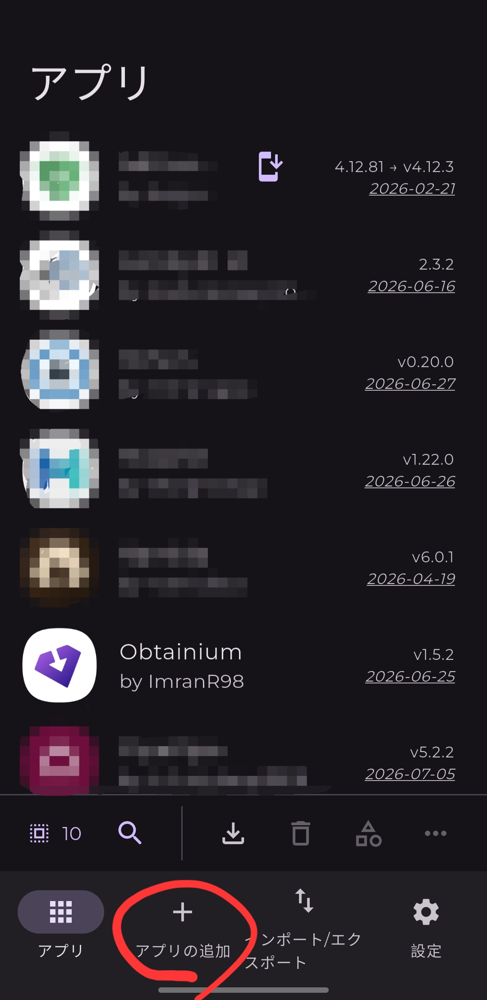
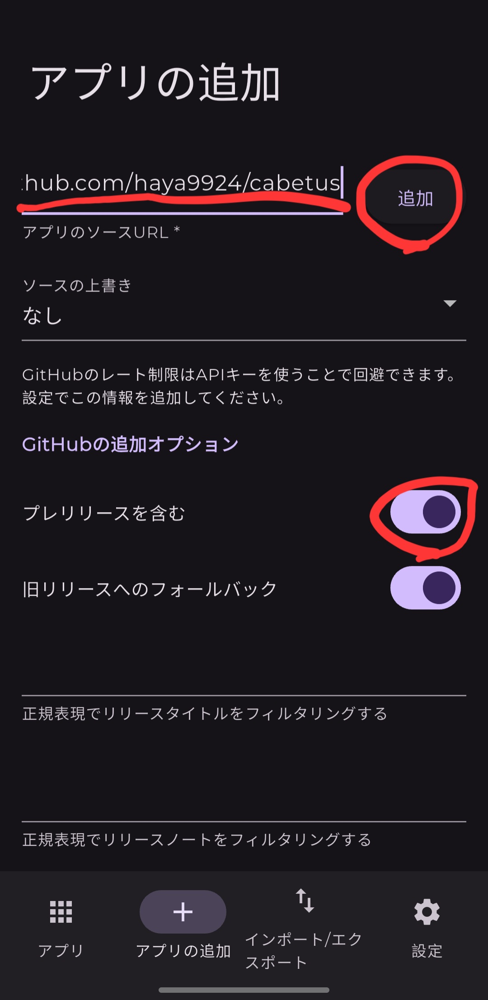
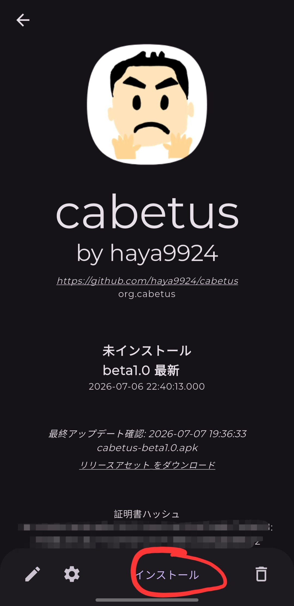

# Androidアプリ「Cabetus」導入ガイド 

初めてAPKファイル（Google Playストア以外からのアプリ）をインストールする方でも、迷わず簡単にできるように分かりやすく解説します！

Cabetusをインストールする方法は、以下の2種類があります。

1. **【推奨】Obtainium（オブタイニウム）経由でのインストール**
   アプリのアップデート確認や自動更新が簡単にできるようになるので、とってもおすすめです！
2. **GitHubから直接ダウンロードしてインストールする方法**
   とにかく今すぐシンプルにアプリを入れて試してみたい方向けです。

---

## 1. 【推奨】Obtainiumを利用したインストール方法 🔄

Obtainiumという管理アプリを使うことで、今後Cabetusにアップデートがあったときも、簡単に最新版に更新できるようになります！

### 🛠️ ステップ 1: Obtainium（管理アプリ）の準備
1. **Obtainiumの公式GitHubからファイルをダウンロード**
   スマホのブラウザでObtainiumの公式GitHub（ https://github.com/Obtainium/Obtainium ）を開き、「Releases」ページなどから最新の `.apk` ファイルをダウンロードします。(app-release.apk 推奨)
2. **ダウンロードしたファイルを開く**
   スマホの「ファイル」アプリ（ファイラー）を開き、ダウンロードフォルダ内にある `.apk` ファイルをタップして開きます。
3. **「提供元不明のアプリ」のインストールを許可（初回のみ）**
   初めてPlayストア以外からアプリを入れる場合、セキュリティ画面でブロックされることがあります。
   画面の指示に従って設定を開き、**「この提供元のアプリを許可」**をオンにしてください。
   *(※端末のメーカーやAndroidのバージョンによって設定画面が少し異なります。参考：https://aprico-media.com/posts/7441 )*
4. **インストールを完了してアプリを開く**
   許可をオンにした後、画面の指示に従ってインストールを完了させ、Obtainiumアプリを起動します。

### 🚀 ステップ 2: Cabetusアプリの追加
1. **「アプリを追加」をタップ**
   Obtainiumを開いたら、画面にある**「アプリを追加（Add App）」**のボタンをタップします。

   

2. **設定を入力して追加**
   * **アプリのソースURL（App Source URL）**の欄に、以下のURLをコピーして貼り付けます。
     `https://github.com/haya9924/cabetus`
   * **「プレリリースを含む（Include Prereleases）」**のスイッチを**オン**にします。
   * URLの横にある**「追加（Add）」**ボタンをクリックします。
   
   

3. **Cabetusのインストール**
   画面が切り替わったら、下部にある**「インストール（Install）」**をクリックします。
   *(※ここでも再度、「提供元不明のアプリのインストールを許可」を求められる場合があるので、画面の指示に従って許可してくださいね)*
   
   

これで、Obtainium経由での導入はバッチリ完了です！これからは自動でアップデートの確認ができるようになって快適ですよ。

---

## 2. GitHubから直接インストールする方法 📥

「まずは手軽に1回だけインストールしてみたい！」という方は、こちらの手順で行ってください。

1. **CabetusのGitHubページにアクセス**
   スマホのブラウザで、以下のCabetus公式GitHubページを開きます。
   👉 https://github.com/haya9924/cabetus
2. **最新のAPKファイルをダウンロード**
   ページ内の「Releases」セクション、または最新リリースの案内から、`.apk` と書かれたファイルをタップしてダウンロードします。
3. **ダウンロードしたファイルを開いてインストール**
   スマホの「ファイル」アプリから、ダウンロードした `.apk` ファイルをタップします。
4. **「提供元不明のアプリ」を許可してインストール**
   （Obtainiumの手順と同様に）初回は警告が出ることがあるので、設定画面でインストールを許可します。その後、画面の指示通りに「インストール」をタップすれば完了です！
